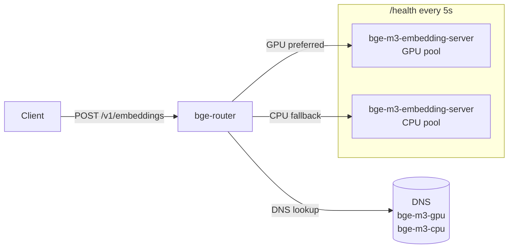

# bge-router

[](https://github.com/Fulton-Engineering-Services/bge-router/actions/workflows/ci.yml)
[](LICENSE)

Lightweight HTTP reverse proxy for [bge-m3-embedding-server](https://github.com/Fulton-Engineering-Services/bge-m3-embedding-server) that routes embedding requests between GPU and CPU upstream pools, with hedged-race fallback for GPU cold-start and scale-to-zero scenarios.

## What it is

`bge-router` is a transparent, stateless HTTP reverse proxy designed to sit in front of one or more [`bge-m3-embedding-server`](https://github.com/Fulton-Engineering-Services/bge-m3-embedding-server) instances. It discovers upstreams via DNS (compatible with AWS Cloud Map, Docker Compose networks, Kubernetes services, or any DNS-based service discovery), maintains a live health view of each upstream, and routes each request to the best available backend — GPU preferred, CPU as fallback.

The router is transparent: it exposes the same `/v1/embeddings`, `/v1/sparse-embeddings`, and `/v1/embeddings:both` API as `bge-m3-embedding-server`. Clients point at the router and never observe the underlying pool topology.

## Why it exists

GPU instances deliver 5–15× lower inference latency than CPU for transformer embedding workloads — but they are expensive to run continuously and can take minutes to cold-start (model load + optional TensorRT compilation). Running GPU pools at scale-to-zero and routing through a CPU pool during cold-start is a cost-effective operational model, but it creates a latency trap: a naive timeout-then-fallback approach either wastes GPU cycles (the GPU keeps computing after the timeout fires) or adds a hard latency penalty before CPU is tried.

`bge-router` solves this with a **hedged race**: GPU fires first; after a configurable delay (`BGE_ROUTER_HEDGE_DELAY_MS`, default 5 s), the router fires CPU in parallel; the first non-5xx response wins, and the loser's in-flight request is cancelled at the source — dropping the future closes the TCP connection so the upstream worker stops. This means:

- Under normal GPU load, GPU always wins before the hedge delay elapses.
- During GPU cold-start or saturation, CPU races and wins after the hedge delay with no additional cancellation latency.
- GPU cycles are not wasted on abandoned requests.

Control-plane paths (`/health`, `/v1/models`) use a lightweight sequential GPU → CPU fallback with a per-upstream hard timeout, keeping failure detection fast and not masking latency.

## Architecture



**DNS discovery** — every 30 seconds, the router resolves `BGE_ROUTER_GPU_DNS` and `BGE_ROUTER_CPU_DNS` using the system resolver (`tokio::net::lookup_host`). New addresses start as `Unknown`; disappeared addresses are removed automatically. Works with any DNS-based service discovery — AWS Cloud Map, Docker Compose networking, Kubernetes services, or plain `/etc/hosts` entries.

**Health polling** — every 5 seconds, the router GETs `/health` on all known upstreams concurrently. It parses the bge-m3 health response (`status`, `workers.live`, `queue_depth`) and atomically updates the routing snapshot via a lock-free `ArcSwap`.

**Routing policy** — picks the lowest-queue-depth healthy upstream, GPU pool first. Inference paths run a hedged race; control-plane paths fall back sequentially.

**Zero-copy streaming** — the request body is buffered once (required for the hedge/retry), but the response body is streamed directly from upstream to client without intermediate buffering.

## Routing Behavior

### Inference paths (`/v1/embeddings`, `/v1/sparse-embeddings`, `/v1/embeddings:both`)

**Hedged race:**

1. The router picks the best `Ok` GPU upstream and the best `Ok` CPU upstream.
2. The GPU request fires immediately.
3. After `BGE_ROUTER_HEDGE_DELAY_MS` (default 5 000 ms), the CPU request fires in parallel.
4. The first non-5xx response wins; the loser's future is dropped, cancelling its in-flight TCP connection.
5. If only one pool is healthy, that pool is used directly (no hedge penalty).
6. If both return 5xx or error, the GPU error is returned to the client.

### Control-plane paths (`/health`, `/v1/models`, all others)

**Sequential GPU → CPU with hard timeout per upstream:**

1. Try GPU with `BGE_ROUTER_CONTROL_TIMEOUT_MS` hard timeout.
2. If GPU succeeds (non-5xx) → return immediately.
3. If GPU fails, times out, or returns 5xx → try CPU with the same timeout.
4. If CPU also fails → 503.

Worst-case latency: `2 × control_timeout` (default 2 s).

### 503 behavior

The router returns 503 when no healthy upstream exists in either pool — at startup before the first DNS refresh, after all upstreams enter `fail`/`loading` state, or during a persistent DNS outage.

## API Passthrough

The router proxies all requests transparently. It does not modify the embedding API beyond injecting two observability headers:

| Header | Example | Description |
|--------|---------|-------------|
| `X-Bge-Router-Upstream` | `10.0.1.5:8081` | Upstream that served this request |
| `X-Bge-Router-Pool` | `gpu` | Pool type (`gpu` or `cpu`) |

### Router-only endpoint

| Method | Path | Description |
|--------|------|-------------|
| `GET` | `/router/health` | Router's own health — upstream pool snapshot |

## Configuration

All configuration is via environment variables.

| Variable | Default | Description |
|----------|---------|-------------|
| `BGE_ROUTER_BIND` | `0.0.0.0:8081` | TCP bind address |
| `BGE_ROUTER_GPU_DNS` | `bge-m3-gpu` | DNS name for GPU upstreams (each resolved address gets port 8081) |
| `BGE_ROUTER_CPU_DNS` | `bge-m3-cpu` | DNS name for CPU upstreams (each resolved address gets port 8081) |
| `BGE_ROUTER_DNS_REFRESH_SECS` | `30` | DNS refresh interval |
| `BGE_ROUTER_HEALTH_POLL_SECS` | `5` | Health poll interval |
| `BGE_ROUTER_HEDGE_DELAY_MS` | `5000` | Inference paths: ms to wait before firing parallel CPU race against GPU |
| `BGE_ROUTER_CONTROL_TIMEOUT_MS` | `1000` | Control-plane paths: per-upstream hard timeout |
| `BGE_ROUTER_FALLBACK_BUDGET_MS` | _unset_ | **Deprecated.** Seeds `hedge_delay` only when `BGE_ROUTER_HEDGE_DELAY_MS` is unset; logged as WARN at startup. Remove once new vars are deployed. |
| `BGE_ROUTER_HEARTBEAT_SECS` | `60` | Heartbeat log interval (`0` = disable) |
| `BGE_ROUTER_LOG_FORMAT` | auto | `json` (non-TTY default), `text`, `pretty` |
| `RUST_LOG` | `info` | Tracing log filter |

## Running Locally

```bash
# Both pools pointing at a single local bge-m3 instance on port 8081
BGE_ROUTER_GPU_DNS=localhost \
BGE_ROUTER_CPU_DNS=localhost \
  cargo run
```

Verify startup:

```bash
curl http://localhost:8081/router/health | jq .
```

The router starts in under one second — there is no model loading. The pool will be empty until the first DNS refresh cycle resolves the configured names.

For local multi-instance testing, add entries to `/etc/hosts` and point the DNS vars at those names:

```
# /etc/hosts
127.0.0.1  bge-m3-gpu.test
127.0.0.1  bge-m3-cpu.test
```

```bash
BGE_ROUTER_GPU_DNS=bge-m3-gpu.test \
BGE_ROUTER_CPU_DNS=bge-m3-cpu.test \
  cargo run
```

## Docker

```bash
# Build
docker build -t bge-router .

# Run with two separate bge-m3 instances
docker run --rm \
  -p 8081:8081 \
  -e BGE_ROUTER_GPU_DNS=bge-m3-gpu \
  -e BGE_ROUTER_CPU_DNS=bge-m3-cpu \
  bge-router

# Local testing: point both pools at a local bge-m3 instance
docker run --rm \
  -p 8082:8081 \
  -e BGE_ROUTER_GPU_DNS=host.docker.internal \
  -e BGE_ROUTER_CPU_DNS=host.docker.internal \
  -e BGE_ROUTER_LOG_FORMAT=text \
  bge-router
```

A pre-built multi-arch image (linux/amd64 + linux/arm64) is published to GHCR with each release.

## Hypothetical AWS ECS Deployment

One common deployment topology on AWS ECS:

- An internal Application Load Balancer (or ECS Service Connect) fronts the `bge-router` Fargate service. Clients point at the ALB DNS name — they see a single embedding endpoint.
- `bge-router` resolves two AWS Cloud Map service names: one for the GPU pool, one for the CPU pool. Cloud Map registers each running ECS task's private IP as an A record, so the router discovers tasks automatically as ECS scales the service up or down.
- The GPU pool runs on EC2 G-series instances (e.g. g6, g5, g4dn) with scale-to-zero when idle. A CloudWatch metric alarm on queue depth or request count triggers scale-out.
- The CPU pool runs on Fargate and stays at minimum capacity for baseline throughput. It handles all traffic while the GPU pool is scaled to zero or cold-starting.

```
Clients → ALB (internal) → bge-router (Fargate)
                               │
              ┌────────────────┴────────────────┐
              ▼                                 ▼
   bge-m3-gpu.svc.example          bge-m3-cpu.svc.example
   (EC2 G-series, scale-to-zero)   (Fargate, always-on)
```

The router has no AWS SDK dependency — it discovers upstreams purely via DNS, so it works with Cloud Map, ECS Service Connect, or any other DNS-based service registry. Set:

```bash
BGE_ROUTER_GPU_DNS=bge-m3-gpu.svc.example
BGE_ROUTER_CPU_DNS=bge-m3-cpu.svc.example
```

Because the router is stateless, you can run multiple router tasks behind the ALB for high availability. Each task independently reads the same `ArcSwap<PoolSnapshot>` and applies the same routing policy.

### ECS health check

The router starts in < 1 second (no model loading). Use `/router/health` for the ECS task health check — not `/health` (which proxies to an upstream). The minimal runtime image has no `curl`, so use a raw TCP health check:

```bash
exec 3<>/dev/tcp/127.0.0.1/8081 \
  && printf "GET /router/health HTTP/1.0\r\nHost: localhost\r\n\r\n" >&3 \
  && read -t5 s <&3 \
  && [[ $s == *200* ]] || exit 1
```

## Health Endpoint

### `/router/health` (router's own status)

```bash
curl http://localhost:8081/router/health | jq .
```

```json
{
  "status": "ok",
  "gpu_upstreams": [
    {
      "addr": "10.0.1.5:8081",
      "pool_type": "gpu",
      "status": "ok",
      "queue_depth": 0,
      "live_workers": 1,
      "last_seen_secs_ago": 2.1
    }
  ],
  "cpu_upstreams": [
    {
      "addr": "10.0.2.8:8081",
      "pool_type": "cpu",
      "status": "ok",
      "queue_depth": 3,
      "live_workers": 7,
      "last_seen_secs_ago": 1.4
    }
  ]
}
```

| HTTP status | `status` field | Meaning |
|-------------|----------------|---------|
| `200` | `"ok"` | At least one upstream healthy |
| `503` | `"degraded"` | No healthy upstream in any pool |

### `/health` (proxied)

Forwarded to a healthy upstream's `/health` endpoint. Use this to verify end-to-end connectivity to the embedding service.

## Logging

Set `BGE_ROUTER_LOG_FORMAT=json` in production. Structured JSON is compatible with CloudWatch Logs Insights, Datadog, and other log aggregators.

### Key log events

| Event | Level | When |
|-------|-------|------|
| `hedge: firing CPU race` | INFO | Hedge delay elapsed; CPU side about to fire |
| `hedge: GPU won` | INFO | GPU returned non-5xx before CPU |
| `hedge: CPU won` | INFO | CPU returned non-5xx before GPU |
| `hedge: both failed` | WARN | Both upstreams returned 5xx or errored |
| `GPU upstream error, attempting CPU fallback` | WARN | Control-plane: GPU error/timeout |
| `heartbeat` | INFO | Periodic pool summary (gpu_ok_count, cpu_ok_count, queue depths) |

### Useful CloudWatch Logs Insights queries

```
# Hedged-race outcomes: win rate and avg latency by winner
fields @timestamp, path, winner_latency_ms, loser_status
| filter @message like "hedge:" and @message like "won"
| stats count(*) as wins, avg(winner_latency_ms) as avg_ms by @message

# p99 latency by pool (from upstream bge-m3 logs, not router logs)
fields route, total_ms, pool
| filter ispresent(total_ms)
| stats pct(total_ms, 99) as p99_ms by pool
| sort p99_ms desc
```

A sustained `hedge: CPU won` rate indicates the GPU pool is consistently slower than the hedge delay — either tune `BGE_ROUTER_HEDGE_DELAY_MS` or investigate GPU capacity.

### Heartbeat event

Every `BGE_ROUTER_HEARTBEAT_SECS` (default 60 s):

```json
{
  "fields": {
    "message": "heartbeat",
    "gpu_upstreams": 1,
    "cpu_upstreams": 3,
    "gpu_ok_count": 1,
    "cpu_ok_count": 3,
    "gpu_queue_depth_sum": 0,
    "cpu_queue_depth_sum": 5
  }
}
```

## Building

```bash
cargo build --release
cargo nextest run --no-tests=warn
cargo clippy --all-targets -- -D warnings
cargo fmt --all --check
```

No feature flags are required — the router is pure Rust with no optional ML dependencies.

## Graceful Shutdown

The router handles `SIGTERM` (via Axum/Hyper graceful shutdown): it stops accepting new connections and waits for in-flight requests to complete before exiting. Embedding requests typically complete in under 5 seconds under normal load, well within the 30-second `SIGTERM` → `SIGKILL` window used by ECS and most container orchestrators.

## Documentation

| File | Purpose |
|------|---------|
| [`docs/routing-policy.md`](docs/routing-policy.md) | Routing algorithm deep-dive: priority order, `UpstreamStatus` eligibility, tiebreaking, snapshot atomicity, decision flowchart |
| [`docs/upstream-health.md`](docs/upstream-health.md) | Health polling mechanics: poll interval, bge-m3 response schema, status mapping, failure behaviour, `last_seen` staleness |
| [`docs/dns-discovery.md`](docs/dns-discovery.md) | DNS-based upstream discovery: refresh interval, merge semantics, scale-to-zero behaviour, failure handling |
| [`docs/fallback.md`](docs/fallback.md) | Hedged race vs sequential timeout: triggers, exclusions, request body buffering, cancellation guarantee, observability |
| [`docs/performance.md`](docs/performance.md) | Latency and throughput characteristics: router overhead, CPU/GPU profiles, memory footprint, bottleneck identification |
| [`docs/deployment.md`](docs/deployment.md) | Deployment guide: Docker, ECS topology, env var reference, health check endpoints, observability |
| [`docs/decisions/001-dns-based-discovery.md`](docs/decisions/001-dns-based-discovery.md) | ADR: Why DNS-based discovery instead of a static config list |
| [`docs/decisions/002-arc-swap-snapshot.md`](docs/decisions/002-arc-swap-snapshot.md) | ADR: Why `ArcSwap<PoolSnapshot>` for lock-free routing state |

## License

Apache-2.0 — see [LICENSE](LICENSE).
