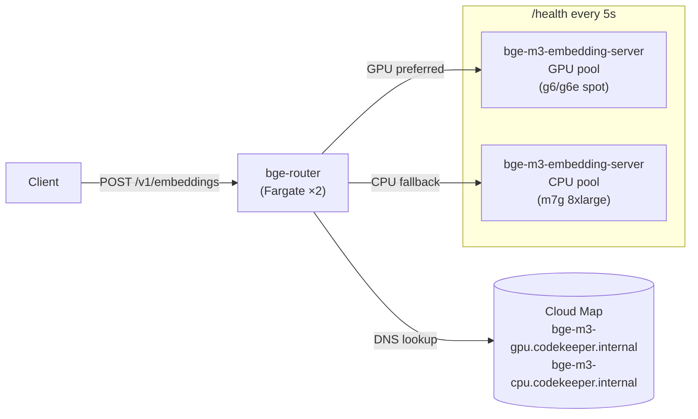

# bge-router

[](https://github.com/Fulton-Engineering-Services/bge-router/actions/workflows/ci.yml)
[](LICENSE)

Transparent HTTP reverse proxy for [bge-m3-embedding-server](https://github.com/Fulton-Engineering-Services/bge-m3-embedding-server) that routes embedding requests between GPU and CPU upstream pools discovered via DNS.

## Overview

`bge-router` sits in front of one or more `bge-m3-embedding-server` instances and routes each request to the best available upstream. The strategy depends on the route:

- **Inference paths** (`/v1/embeddings`, `/v1/sparse-embeddings`, `/v1/embeddings:both`) use a **hedged race**: GPU fires first; after `BGE_ROUTER_HEDGE_DELAY_MS` (default 5 s) the router also fires CPU in parallel; the first non-5xx response wins and the loser's future is dropped (cancels the in-flight upstream request so the GPU can stop computing).
- **Control-plane paths** (`/health`, `/v1/models`, etc.) use a **sequential GPU → CPU fallback** with a hard timeout per upstream (`BGE_ROUTER_CONTROL_TIMEOUT_MS`, default 1 s).
- **503** — when no healthy upstream exists in either pool.

The router is transparent: it exposes the same `/v1/embeddings`, `/v1/sparse-embeddings`, and `/v1/embeddings:both` API as `bge-m3-embedding-server`. Clients point at the router and never see the underlying pool topology.

## Architecture



**DNS discovery** — every 30 seconds, the router resolves `BGE_ROUTER_GPU_DNS` and `BGE_ROUTER_CPU_DNS` via AWS Cloud Map (or any DNS). New addresses start as `Unknown`; disappeared addresses are removed automatically.

**Health polling** — every 5 seconds, the router GETs `/health` on all known upstreams concurrently. It parses the bge-m3 health response (`status`, `workers.live`, `queue_depth`) and atomically updates the routing snapshot.

**Routing policy** — picks the lowest-queue-depth healthy upstream, GPU pool first. Inference paths then run a hedged race against CPU after `BGE_ROUTER_HEDGE_DELAY_MS`; control-plane paths fall back sequentially with a per-upstream hard timeout (`BGE_ROUTER_CONTROL_TIMEOUT_MS`). The race loser's future is dropped, which cancels its in-flight reqwest call. Once any response bytes have been streamed to the client, retry is suppressed.

**Zero-copy streaming** — the request body is buffered once (required for retry), but the response body is streamed directly from upstream to client without intermediate buffering.

## API Passthrough

The router proxies all requests transparently to the selected upstream. It does not add or modify the embedding API beyond injecting two observability headers:

| Header | Example | Description |
|--------|---------|-------------|
| `X-Bge-Router-Upstream` | `10.0.1.5:8081` | Upstream that served this request |
| `X-Bge-Router-Pool` | `gpu` | Pool type (`gpu` or `cpu`) |

### Router-only endpoint

| Method | Path | Description |
|--------|------|-------------|
| `GET` | `/router/health` | Router's own health — upstream pool snapshot |

## Configuration

All configuration is via environment variables.

| Variable | Default | Description |
|----------|---------|-------------|
| `BGE_ROUTER_BIND` | `0.0.0.0:8081` | TCP bind address |
| `BGE_ROUTER_GPU_DNS` | `bge-m3-gpu.codekeeper.internal` | DNS name for GPU upstreams |
| `BGE_ROUTER_CPU_DNS` | `bge-m3-cpu.codekeeper.internal` | DNS name for CPU upstreams |
| `BGE_ROUTER_DNS_REFRESH_SECS` | `30` | DNS refresh interval |
| `BGE_ROUTER_HEALTH_POLL_SECS` | `5` | Health poll interval |
| `BGE_ROUTER_HEDGE_DELAY_MS` | `5000` | Inference paths: ms to wait before firing parallel CPU race against GPU |
| `BGE_ROUTER_CONTROL_TIMEOUT_MS` | `1000` | Control-plane paths: per-upstream hard timeout |
| `BGE_ROUTER_FALLBACK_BUDGET_MS` | _unset_ | **Deprecated.** Seeds `hedge_delay` only when `BGE_ROUTER_HEDGE_DELAY_MS` is unset; logged as WARN at startup |
| `BGE_ROUTER_HEARTBEAT_SECS` | `60` | Heartbeat log interval (`0` = disable) |
| `BGE_ROUTER_LOG_FORMAT` | auto | `json` (non-TTY default), `text`, `pretty` |
| `RUST_LOG` | `info` | Tracing log filter |

## Docker

```bash
# Pull
docker pull ghcr.io/fulton-engineering-services/bge-router:latest

# Run
docker run --rm \
  -p 8081:8081 \
  -e BGE_ROUTER_GPU_DNS=bge-m3-gpu.codekeeper.internal \
  -e BGE_ROUTER_CPU_DNS=bge-m3-cpu.codekeeper.internal \
  ghcr.io/fulton-engineering-services/bge-router:latest
```

## Deployment

`bge-router` is deployed as a 2-task Fargate service via the [cdk-bedrock-litellm](https://github.com/Fulton-Engineering-Services/cdk-bedrock-litellm) CDK project:

- Cloud Map name: `bge-m3.codekeeper.internal` (transparent to existing clients)
- GPU pool: `bge-m3-gpu.codekeeper.internal` (ECS spot instances: g6/g6e/g5, scale-to-zero)
- CPU pool: `bge-m3-cpu.codekeeper.internal` (ECS on-demand, always-on)

The router registers itself as `bge-m3.codekeeper.internal`, so existing services that point to that DNS name require no changes.

## Building

```bash
cargo build --release
cargo nextest run --no-tests=warn
cargo clippy --all-targets -- -D warnings
```

## License

Apache-2.0 — see [LICENSE](LICENSE).
