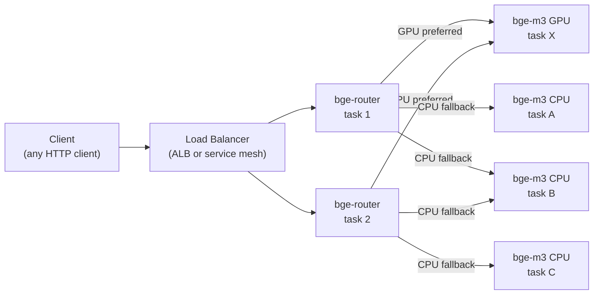

# Deployment Guide

## Architecture Overview



Clients point at the load balancer or service discovery name for the router. They never need to know about the pool split — the router's API surface is identical to `bge-m3-embedding-server`.

## Docker Deployment (Standalone / Testing)

```bash
docker run --rm \
  -p 8081:8081 \
  -e BGE_ROUTER_GPU_DNS=bge-m3-gpu \
  -e BGE_ROUTER_CPU_DNS=bge-m3-cpu \
  -e BGE_ROUTER_LOG_FORMAT=text \
  ghcr.io/fulton-engineering-services/bge-router:latest
```

For local testing with a single upstream (e.g. a local bge-m3 instance on port 8081):

```bash
docker run --rm \
  -p 8082:8081 \
  -e BGE_ROUTER_GPU_DNS=host.docker.internal \
  -e BGE_ROUTER_CPU_DNS=host.docker.internal \
  -e BGE_ROUTER_LOG_FORMAT=text \
  ghcr.io/fulton-engineering-services/bge-router:latest
```

The router resolves `host.docker.internal:8081` and treats both pools as pointing at the same upstream. Requests route to GPU first; because both pools resolve to the same address, the same backend serves both hedge legs.

## AWS ECS Deployment (Example Topology)

One common deployment on AWS ECS:

- An internal ALB or ECS Service Connect fronts the router service. Clients connect here.
- The router resolves two AWS Cloud Map service names — one for the GPU pool and one for the CPU pool. Cloud Map registers each running ECS task's private IP as an A record when its health check passes. The router picks up new tasks on the next DNS refresh cycle (default 30 s), with no redeployment or config change required.
- The GPU pool runs on EC2 G-series instances (e.g. g6, g5, g4dn) at scale-to-zero. A CloudWatch alarm triggers scale-out when needed.
- The CPU pool runs on Fargate (or EC2) and stays at minimum capacity for baseline throughput.

**Example service names:**

| Service | Cloud Map name | Hardware |
|---------|---------------|----------|
| bge-router | `bge-m3.svc.example` | Fargate (lightweight, no model loading) |
| GPU pool | `bge-m3-gpu.svc.example` | EC2 G-series, scale-to-zero |
| CPU pool | `bge-m3-cpu.svc.example` | Fargate, always-on |

```bash
# Router env vars for this topology
BGE_ROUTER_GPU_DNS=bge-m3-gpu.svc.example
BGE_ROUTER_CPU_DNS=bge-m3-cpu.svc.example
```

Set the Cloud Map DNS TTL to 30 seconds to match `BGE_ROUTER_DNS_REFRESH_SECS`. Effective
maximum staleness:

```
effective_staleness = dns_refresh_secs + health_poll_secs
                    = 30 s (DNS) + 5 s (health) = 35 s
```

The router has no AWS SDK dependency — it discovers upstreams entirely through DNS, so it also works with ECS Service Connect, Docker Compose, Kubernetes, or any resolver that exposes service members as A records.

## TLS

`bge-router` supports optional TLS on both the inbound listener (what clients
connecting to the router see) and outbound upstream connections (router → bge-m3).
Both surfaces are opt-in and independent of each other.

See **[docs/tls.md](tls.md)** for the full guide, including build requirements,
environment variables, certificate provisioning, and typical deployment
configurations.

Quick reference for the most common production setup (full mutual TLS with a shared
internal CA):

```bash
BGE_ROUTER_TLS_CERT_PATH=/tls/leaf.crt    # inbound listener cert
BGE_ROUTER_TLS_KEY_PATH=/tls/leaf.key     # inbound listener key
BGE_ROUTER_UPSTREAM_TLS=1                 # use HTTPS for upstream connections
BGE_ROUTER_UPSTREAM_CA_BUNDLE=/tls/ca.crt # CA bundle for upstream cert validation
```

The binary must be compiled with `--features tls` for inbound TLS to activate.
Outbound TLS (`BGE_ROUTER_UPSTREAM_TLS`) does not require `--features tls`.

## Environment Variable Reference

| Variable | Default | Description |
|----------|---------|-------------|
| `BGE_ROUTER_BIND` | `0.0.0.0:8081` | TCP bind address |
| `BGE_ROUTER_GPU_DNS` | `bge-m3-gpu` | DNS name to resolve for GPU upstreams |
| `BGE_ROUTER_CPU_DNS` | `bge-m3-cpu` | DNS name to resolve for CPU upstreams |
| `BGE_ROUTER_DNS_REFRESH_SECS` | `30` | How often to re-resolve both DNS names; combine with DNS TTL for effective staleness window |
| `BGE_ROUTER_HEALTH_POLL_SECS` | `5` | How often to poll each upstream's `/health` endpoint |
| `BGE_ROUTER_HEDGE_DELAY_MS` | `5000` | Inference paths only: ms to wait before firing parallel CPU race against GPU |
| `BGE_ROUTER_CONTROL_TIMEOUT_MS` | `1000` | Control-plane paths (`/health`, `/v1/models`, etc.): per-upstream hard timeout |
| `BGE_ROUTER_FALLBACK_BUDGET_MS` | _unset_ | **Deprecated.** When set without `BGE_ROUTER_HEDGE_DELAY_MS`, seeds `hedge_delay`; never seeds `control_timeout`. WARN logged at startup. |
| `BGE_ROUTER_HEARTBEAT_SECS` | `60` | Heartbeat log interval in seconds; `0` disables heartbeat |
| `BGE_ROUTER_LOG_FORMAT` | auto | `json` (default in non-TTY/container), `text`, or `pretty` |
| `RUST_LOG` | `info` | Standard tracing filter (e.g. `bge_router=debug`) |
| `BGE_ROUTER_TLS_CERT_PATH` | unset | Inbound listener TLS cert PEM. Requires `--features tls`. Must be set with KEY or neither. See [tls.md](tls.md). |
| `BGE_ROUTER_TLS_KEY_PATH` | unset | Inbound listener TLS private key PEM. Must be set with CERT or neither. |
| `BGE_ROUTER_UPSTREAM_TLS` | unset | Set to `1` to use HTTPS for all upstream bge-m3 connections. Does not require `--features tls`. |
| `BGE_ROUTER_UPSTREAM_CA_BUNDLE` | unset | Path to CA bundle PEM for validating upstream bge-m3 certs. Used with `BGE_ROUTER_UPSTREAM_TLS`. |

## Health Checking

### `/router/health` (Router's Own Status)

Returns the router's current view of the upstream pool. Use this for load balancer / orchestrator health checks and debugging.

```bash
curl http://localhost:8081/router/health | jq .
```

Response shape:

```json
{
  "status": "ok",
  "gpu_upstreams": [
    {
      "addr": "10.0.1.5:8081",
      "pool_type": "gpu",
      "status": "ok",
      "queue_depth": 0,
      "live_workers": 1,
      "last_seen_secs_ago": 2.1
    }
  ],
  "cpu_upstreams": [
    {
      "addr": "10.0.2.8:8081",
      "pool_type": "cpu",
      "status": "ok",
      "queue_depth": 3,
      "live_workers": 7,
      "last_seen_secs_ago": 1.4
    }
  ]
}
```

| `/router/health` HTTP status | `status` field | Meaning |
|------------------------------|----------------|---------|
| `200` | `"ok"` | At least one upstream healthy |
| `503` | `"degraded"` | No healthy upstream in any pool |

### `/health` (Proxied)

Forwards to a healthy upstream's `/health` endpoint. Use this to verify end-to-end connectivity to the embedding service.

```bash
curl http://localhost:8081/health | jq .
```

### Minimal TCP health check (no curl required)

The router starts in < 1 second (no model loading). If your runtime image does not include `curl`, use a raw `/dev/tcp` check:

```bash
exec 3<>/dev/tcp/127.0.0.1/8081 \
  && printf "GET /router/health HTTP/1.0\r\nHost: localhost\r\n\r\n" >&3 \
  && read -t5 s <&3 \
  && [[ $s == *200* ]] || exit 1
```

## Observability

### Log Format

Set `BGE_ROUTER_LOG_FORMAT=json` in production for CloudWatch Logs Insights (or any structured log aggregator) compatibility. The router emits structured JSON with a `fields` wrapper matching the `bge-m3-embedding-server` format.

### Heartbeat Events

Every `BGE_ROUTER_HEARTBEAT_SECS` seconds (default 60 s), the router emits a structured `INFO` event:

```json
{
  "fields": {
    "message": "heartbeat",
    "gpu_upstreams": 1,
    "cpu_upstreams": 3,
    "gpu_ok_count": 1,
    "cpu_ok_count": 3,
    "gpu_queue_depth_sum": 0,
    "cpu_queue_depth_sum": 5
  }
}
```

| Field | Description |
|-------|-------------|
| `gpu_upstreams` | Total discovered GPU upstreams (all statuses) |
| `cpu_upstreams` | Total discovered CPU upstreams (all statuses) |
| `gpu_ok_count` | GPU upstreams currently eligible for routing |
| `cpu_ok_count` | CPU upstreams currently eligible for routing |
| `gpu_queue_depth_sum` | Sum of `queue_depth` across all GPU upstreams |
| `cpu_queue_depth_sum` | Sum of `queue_depth` across all CPU upstreams |

### Response Headers for Traceability

Every proxied response includes two router-injected headers:

| Header | Example | Description |
|--------|---------|-------------|
| `X-Bge-Router-Upstream` | `10.0.1.5:8081` | IP:port of the upstream that served the request |
| `X-Bge-Router-Pool` | `gpu` or `cpu` | Which pool the upstream belongs to |

Use `X-Bge-Router-Pool` to split latency metrics by pool type in your log aggregator.

### CloudWatch Logs Insights

```
# Hedged-race outcomes
fields @timestamp, path, winner_latency_ms, loser_status
| filter @message like "hedge:" and @message like "won"
| stats count(*) as wins, avg(winner_latency_ms) as avg_ms by @message

# GPU vs CPU request split (based on bge-m3 upstream logs with X-Bge-Router-Pool context)
fields route, total_ms
| filter ispresent(total_ms)
| stats pct(total_ms, 99) as p99_ms by route
| sort p99_ms desc
```

## Graceful Shutdown

The router binds a `SIGTERM` handler (via Axum/Hyper's graceful shutdown) that stops accepting new connections and waits for in-flight requests to complete before exiting. ECS sends `SIGTERM` when stopping a task and waits 30 seconds before `SIGKILL`. Embedding requests typically complete in < 5 seconds under normal load, so in-flight requests drain cleanly.

## Rollback

If deploying via ECS, configure a circuit breaker with rollback enabled on the router service. If a new task fails its health check (`/router/health` does not return 200), ECS rolls back to the previous task definition automatically.
