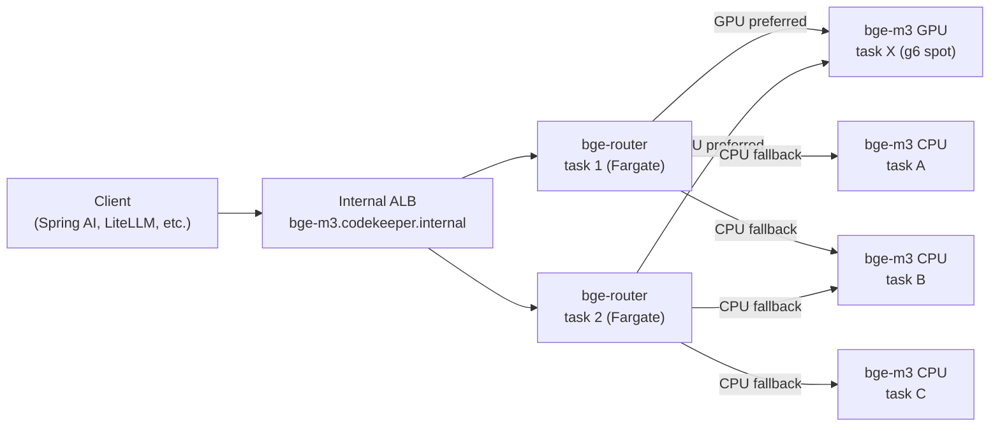

# Deployment Guide

## Architecture Overview



Cloud Map DNS names:
- `bge-m3.codekeeper.internal` — router Fargate service (clients connect here)
- `bge-m3-cpu.codekeeper.internal` — CPU pool tasks
- `bge-m3-gpu.codekeeper.internal` — GPU pool tasks (scale-to-zero)

Clients point at `bge-m3.codekeeper.internal`. They never need to know about
the pool split. The router's API surface is identical to `bge-m3-embedding-server`.

## CDK Deployment (Primary Path)

The router and its upstream pools are deployed together from the
`cdk-bedrock-litellm` stacks. The CDK constructs that provision this system:

| Construct | Cloud Map name | Hardware |
|-----------|---------------|----------|
| `EmbeddingRouterServiceBuilder` | `bge-m3.codekeeper.internal` | Fargate 512 CPU / 1024 MiB |
| `EmbeddingGpuServiceBuilder` | `bge-m3-gpu.codekeeper.internal` | EC2 g6/g6e/g5 spot, 8192 CPU / 30720 MiB |
| CPU embedding service (existing) | `bge-m3-cpu.codekeeper.internal` | Fargate (existing) |

**Prerequisites:**
- `cdk-bedrock-litellm` ApplicationStack deployed
- GPU capacity provider provisioned (g6/g6e/g5 spot ASG)
- EFS access point for ONNX model cache shared between CPU and GPU pools

**Deployment command:**

```bash
cd cdk-bedrock-litellm
yarn cdk deploy ApplicationStack
```

No client changes are required when migrating from a direct `bge-m3-embedding-server`
deployment. The router service takes over the `bge-m3` Cloud Map name that
the CPU service previously owned.

## Docker Deployment (Standalone / Testing)

```bash
docker run --rm \
  -p 8081:8081 \
  -e BGE_ROUTER_GPU_DNS=bge-m3-gpu.example.internal \
  -e BGE_ROUTER_CPU_DNS=bge-m3-cpu.example.internal \
  -e BGE_ROUTER_LOG_FORMAT=text \
  ghcr.io/fulton-engineering-services/bge-router:latest
```

For local testing with a single upstream (e.g. a local bge-m3 instance on
port 8081):

```bash
docker run --rm \
  -p 8082:8081 \
  -e BGE_ROUTER_GPU_DNS=host.docker.internal \
  -e BGE_ROUTER_CPU_DNS=host.docker.internal \
  -e BGE_ROUTER_LOG_FORMAT=text \
  ghcr.io/fulton-engineering-services/bge-router:latest
```

The router resolves `host.docker.internal:8081` and treats both pools as
pointing at the same upstream.

## Environment Variable Reference

| Variable | Default | Description |
|----------|---------|-------------|
| `BGE_ROUTER_BIND` | `0.0.0.0:8081` | TCP bind address |
| `BGE_ROUTER_GPU_DNS` | `bge-m3-gpu.codekeeper.internal` | DNS name to resolve for GPU upstreams |
| `BGE_ROUTER_CPU_DNS` | `bge-m3-cpu.codekeeper.internal` | DNS name to resolve for CPU upstreams |
| `BGE_ROUTER_DNS_REFRESH_SECS` | `30` | How often to re-resolve both DNS names; combine with Cloud Map TTL for effective staleness window |
| `BGE_ROUTER_HEALTH_POLL_SECS` | `5` | How often to poll each upstream's `/health` endpoint |
| `BGE_ROUTER_HEDGE_DELAY_MS` | `5000` | Inference paths only: ms to wait before firing parallel CPU race against GPU |
| `BGE_ROUTER_CONTROL_TIMEOUT_MS` | `1000` | Control-plane paths (`/health`, `/v1/models`, etc.): per-upstream hard timeout |
| `BGE_ROUTER_FALLBACK_BUDGET_MS` | _unset_ | **Deprecated.** When set without `BGE_ROUTER_HEDGE_DELAY_MS`, seeds `hedge_delay`; never seeds `control_timeout`. WARN logged at startup. |
| `BGE_ROUTER_HEARTBEAT_SECS` | `60` | Heartbeat log interval in seconds; `0` disables heartbeat |
| `BGE_ROUTER_LOG_FORMAT` | auto | `json` (default in non-TTY/container), `text`, or `pretty` |
| `RUST_LOG` | `info` | Standard tracing filter (e.g. `bge_router=debug`) |

## Health Checking

### `/router/health` (Router's Own Status)

Returns the router's current view of the upstream pool. Use this for ECS
health checks and debugging.

```bash
curl http://localhost:8081/router/health | jq .
```

Response shape:

```json
{
  "status": "ok",
  "gpu_upstreams": [
    {
      "addr": "10.0.1.5:8081",
      "pool_type": "gpu",
      "status": "ok",
      "queue_depth": 0,
      "live_workers": 1,
      "last_seen_secs_ago": 2.1
    }
  ],
  "cpu_upstreams": [
    {
      "addr": "10.0.2.8:8081",
      "pool_type": "cpu",
      "status": "ok",
      "queue_depth": 3,
      "live_workers": 7,
      "last_seen_secs_ago": 1.4
    }
  ]
}
```

| `/router/health` HTTP status | `status` field | Meaning |
|------------------------------|----------------|---------|
| `200` | `"ok"` | At least one upstream healthy |
| `503` | `"degraded"` | No healthy upstream in any pool |

### `/health` (Proxied)

Forwards to a healthy upstream's `/health` endpoint. Use this to verify
end-to-end connectivity to the embedding service.

```bash
curl http://localhost:8081/health | jq .
```

### ECS Health Check

The CDK deployment uses a bash `/dev/tcp` check against `/router/health`
(not `/health`) because:
- The router starts in < 1 second (no model loading), so the health check
  fires quickly
- `/router/health` returns 503 with `"degraded"` status if no upstreams are
  ready — the task stays unhealthy until at least one upstream is polled Ok
- `curl` is not installed in the minimal runtime image

```bash
# Equivalent to the CDK health check
exec 3<>/dev/tcp/127.0.0.1/8081 \
  && printf "GET /router/health HTTP/1.0\r\nHost: localhost\r\n\r\n" >&3 \
  && read -t5 s <&3 \
  && [[ $s == *200* ]] || exit 1
```

## Observability

### Log Format

Set `BGE_ROUTER_LOG_FORMAT=json` in production for CloudWatch Logs Insights
compatibility. The router emits structured JSON with a `fields` wrapper
(matching the bge-m3-embedding-server format).

### Heartbeat Events

Every `BGE_ROUTER_HEARTBEAT_SECS` seconds (default 60 s), the router emits
a structured `INFO` event:

```json
{
  "fields": {
    "message": "heartbeat",
    "gpu_upstreams": 1,
    "cpu_upstreams": 3,
    "gpu_ok_count": 1,
    "cpu_ok_count": 3,
    "gpu_queue_depth_sum": 0,
    "cpu_queue_depth_sum": 5
  }
}
```

| Field | Description |
|-------|-------------|
| `gpu_upstreams` | Total discovered GPU upstreams (all statuses) |
| `cpu_upstreams` | Total discovered CPU upstreams (all statuses) |
| `gpu_ok_count` | GPU upstreams currently eligible for routing |
| `cpu_ok_count` | CPU upstreams currently eligible for routing |
| `gpu_queue_depth_sum` | Sum of `queue_depth` across all GPU upstreams |
| `cpu_queue_depth_sum` | Sum of `queue_depth` across all CPU upstreams |

### Response Headers for Traceability

Every proxied response includes two router-injected headers:

| Header | Example | Description |
|--------|---------|-------------|
| `X-Bge-Router-Upstream` | `10.0.1.5:8081` | IP:port of the upstream that served the request |
| `X-Bge-Router-Pool` | `gpu` or `cpu` | Which pool the upstream belongs to |

Use `X-Bge-Router-Pool` to split latency metrics by pool type in CloudWatch:

```
# Suggested CloudWatch Logs Insights metric filter on upstream bge-m3 logs
# (the router logs don't currently emit per-request timing)
fields @timestamp, pool, total_ms
| filter ispresent(total_ms)
| stats pct(total_ms, 99) as p99_ms by pool
```

### CloudWatch Metric Filter for GPU vs CPU Routing Ratio

Create a metric filter on the router's log group to track how often requests
go to GPU vs CPU:

```json
{
  "filterPattern": "{ $.fields.message = \"fallback\" }",
  "metricName": "BgeRouterFallbackCount",
  "metricValue": "1"
}
```

A non-zero `BgeRouterFallbackCount` over time indicates GPU upstreams are
regularly failing within the fallback budget — worth investigating.

## Graceful Shutdown

The router binds a `SIGTERM` handler (via Axum/Hyper's graceful shutdown) that
stops accepting new connections and waits for in-flight requests to complete
before exiting. ECS sends `SIGTERM` when stopping a task and waits 30 seconds
before `SIGKILL`. Embedding requests typically complete in < 5 seconds under
normal load, so in-flight requests drain cleanly.

## Rollback

The CDK deployment uses `circuitBreaker: { rollback: true }` on the router
Fargate service. If a new task fails its health check (`/router/health` does
not return 200), ECS rolls back to the previous task definition automatically.
