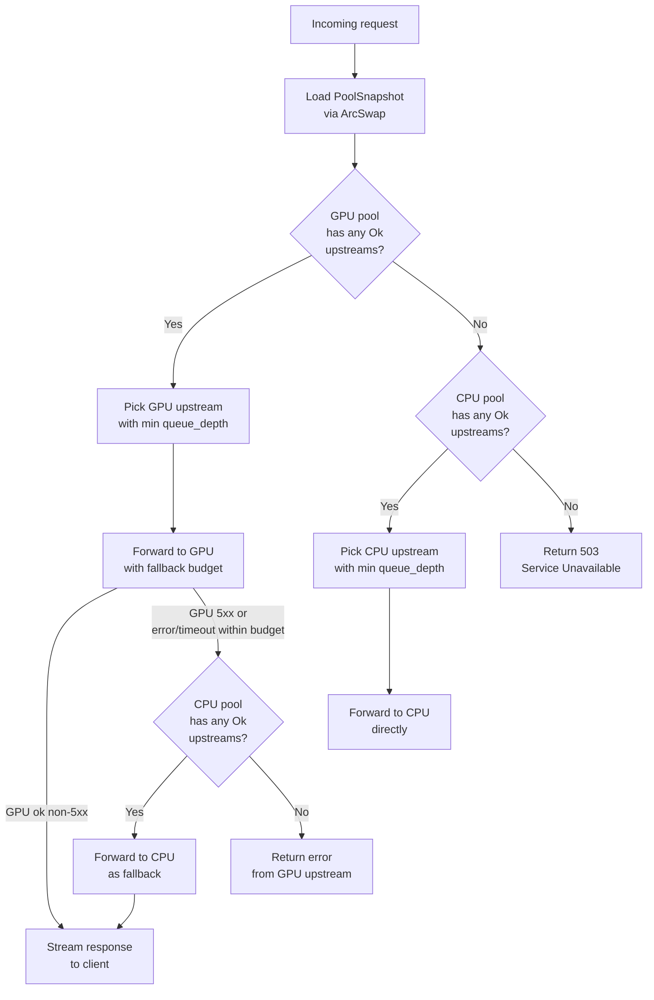

# Routing Policy

`bge-router` selects one upstream per request by evaluating the current
`PoolSnapshot` against a fixed priority order. The decision is O(n) where
n is the total number of discovered upstreams, takes microseconds on the hot
path, and never blocks (the snapshot is read via a lock-free `ArcSwap` load).

## Priority Order

```
1. GPU pool  — pick the Ok upstream with the lowest queue_depth
2. CPU pool  — pick the Ok upstream with the lowest queue_depth
3. No match  — return 503 Service Unavailable
```

GPU is always preferred over CPU regardless of queue depth. A GPU upstream
with 20 queued requests is still chosen over an idle CPU upstream. This is
intentional: GPU inference is 5–15× faster per request for long-sequence
inputs, so a queued GPU upstream still delivers lower expected latency than
an idle CPU upstream under most real workloads.

## UpstreamStatus Values and Eligibility

| `UpstreamStatus` | Source bge-m3 status strings | Eligible for routing |
|------------------|------------------------------|----------------------|
| `Ok`             | `"ok"`, `"warn"`             | Yes                  |
| `Loading`        | `"loading"`, `"idle"`        | No                   |
| `Fail`           | `"fail"`, non-2xx HTTP       | No                   |
| `Unknown`        | no poll yet, parse error     | No                   |

`"warn"` (some workers exited) maps to `Ok` because the upstream is still
accepting requests. `"idle"` (models unloaded after idle timeout) maps to
`Loading` because a request would trigger a reload — the upstream is
temporarily unavailable.

A failed health poll (connection refused, timeout, non-2xx response) sets
the upstream to `Fail`. An upstream whose address just appeared in DNS and
hasn't been polled yet is `Unknown`. Neither is routed to.

## Tiebreaking Within a Pool

Within each pool, `pick_from_pool` calls `min_by_key(|u| u.queue_depth)` on
the Ok-filtered set. Upstreams with equal queue depth are arbitrarily ordered
by their position in the `Vec` (insertion order from DNS discovery). There is
no random selection or weighted routing — the same upstream wins ties
deterministically.

`queue_depth` is the number of requests currently queued on the upstream's
internal semaphore (from the bge-m3 `/health` response). It is a lagging
indicator: it reflects conditions as of the last successful health poll, not
the instantaneous state. At the default 5-second poll interval, the queue
depth can drift significantly under burst traffic. It remains a useful
signal for distinguishing a heavily-loaded upstream from a lightly-loaded one
at steady state.

## What queue_depth Measures (and What It Doesn't)

`queue_depth` counts requests waiting to acquire a worker semaphore permit.
It does not count:
- Requests currently being processed by a worker (those are in flight, not queued)
- Requests rejected by bge-m3's `max_batch` limit (those never reach the queue)
- Network RTT or tokenization time

A `queue_depth` of 0 means the upstream has at least one idle worker permit
available when the health poll ran. It does not guarantee the upstream is
idle right now.

## Empty Pool Behavior (Startup and DNS Failure)

On startup, both pools are empty (no addresses resolved yet). The routing
policy returns `None`, and the handler returns HTTP 503. This persists until
the first DNS refresh cycle completes and at least one health poll succeeds —
typically within `dns_refresh_secs + health_poll_secs` seconds (35 s at
defaults).

If both DNS names fail to resolve (NXDOMAIN or network error), the pools
stay empty from the last successful merge. Addresses that were previously in
the snapshot but disappeared from DNS are removed on the next successful
refresh. A persistent DNS failure leaves the pools unchanged (neither growing
nor shrinking) until DNS recovers.

When the GPU service is scaled to zero, `bge-m3-gpu.codekeeper.internal`
returns NXDOMAIN or an empty response. The GPU pool empties on the next DNS
refresh, and all traffic routes to CPU.

## Atomic Snapshot Updates

The routing state lives in an `Arc<ArcSwap<PoolSnapshot>>`. Both the DNS
discovery task and the health poll task call `pool.store(Arc::new(new_snapshot))`
to replace the snapshot. Readers on the request path call `pool.load_full()`,
which performs an atomic pointer load — no mutex, no blocking.

Writers (DNS refresh, health poll) build the new snapshot entirely in heap
memory before swapping. The old snapshot is reference-counted and dropped when
the last reader finishes. This means:

- Routing decisions never block on background update tasks
- There is no torn snapshot — a request either sees the old snapshot or the
  new one, never a partial mix of both
- DNS and health tasks write independently; each replaces the full snapshot

Because DNS refresh and health poll run on independent timers, they can both
overwrite each other's snapshot. The health poll reads the current snapshot
before applying updates, so DNS changes are preserved across health poll
cycles, and vice versa (each task starts from the current `pool.load()` result
before constructing the next snapshot).

## Decision Tree



## Future Considerations

**Weighted routing** — the current policy treats all upstreams in a pool as
equal peers. A weighted scheme could favour higher-capacity instances (more
live workers) over lower-capacity ones, independently of queue depth.

**Per-model-variant routing** — when multiple model variants (fp16, fp32,
int8) are deployed concurrently, the router could inspect a request header
(e.g. `X-Bge-Model`) and route to a pool that matches the requested variant.
Today the router is model-agnostic: it assumes all upstreams serve the same
model.

**Feedback-aware load balancing** — queue depth is a lagging signal. A
real-time queue depth injected by the upstream into response headers (e.g.
`X-Bge-Queue-Depth`) would let the router react to load changes without
waiting for the next health poll cycle.
